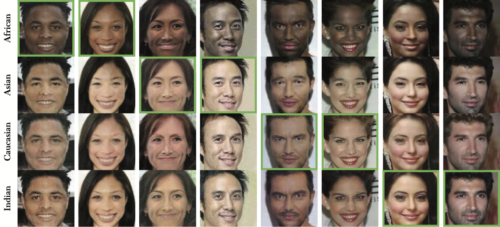
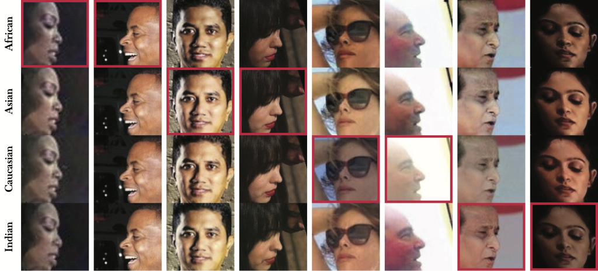
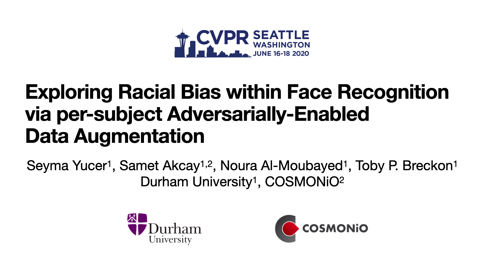

# VGGFace 2 1200-Races: Exploring Racial Bias within Face Recognition via per-subject Adversarially-Enabled Data Augmentation

This repository provides VGGFace 2 1200 face dataset's annotations and trained transformation models 
presented by [Exploring Racial Bias within Face Recognition via per-subject Adversarially-Enabled Data Augmentation](http://openaccess.thecvf.com/content_CVPRW_2020/papers/w1/Yucer_Exploring_Racial_Bias_Within_Face_Recognition_via_Per-Subject_Adversarially-Enabled_Data_CVPRW_2020_paper.pdf).

## Requirements

Please click to download [VGGFace 2](http://www.robots.ox.ac.uk/~vgg/data/vgg_face2/) and [pretrained models](https://durhamuniversity-my.sharepoint.com/:u:/g/personal/xcnf86_durham_ac_uk/EU4mc4gc-kVEujWN37A-TwYBvrciAaXbAx2ojUz7y2AFEg?e=E8Oa7j).

* Python 3.6
* Pytorch > 1.0

## Instructions to generate synthetic images using pre-trained models:

    python generate.py 


## Example Images:




######Figure: A selection of successful (top) and failure (bottom) examples of the racial domain transformation of VGGFace2dataset. Each column contains an original and sythesised face images of the same subject where the green (top) and red (bottom) bordersindicate the original image and the corresponding race labels are laid out on the y-axis

## Example video:
[](https://www.youtube.com/watch?v=KlOwHFz9FBs)
Video Example - click image above to play.

## References:

If you are making use of this work in any way (including our pre-trained models or datasets), _you must please_ reference the following articles in any report,publication, presentation, software release or any other associated materials: 
[Exploring Racial Bias within Face Recognition via per-subject Adversarially-Enabled Data Augmentation](http://openaccess.thecvf.com/content_CVPRW_2020/papers/w1/Yucer_Exploring_Racial_Bias_Within_Face_Recognition_via_Per-Subject_Adversarially-Enabled_Data_CVPRW_2020_paper.pdff) Proceedings of the IEEE/CVF Conference on Computer Vision and Pattern Recognition Workshops, IEEE, 2020.

```
@inproceedings{yucer2020exploring,
  title={Exploring Racial Bias within Face Recognition via per-subject Adversarially-Enabled Data Augmentation},
  author={Yucer, Seyma and Ak{\c{c}}ay, Samet and Al-Moubayed, Noura and Breckon, Toby P},
  booktitle={Proceedings of the IEEE/CVF Conference on Computer Vision and Pattern Recognition Workshops},
  pages={18--19},
  year={2020}
}

```
<!-- 

 -->
